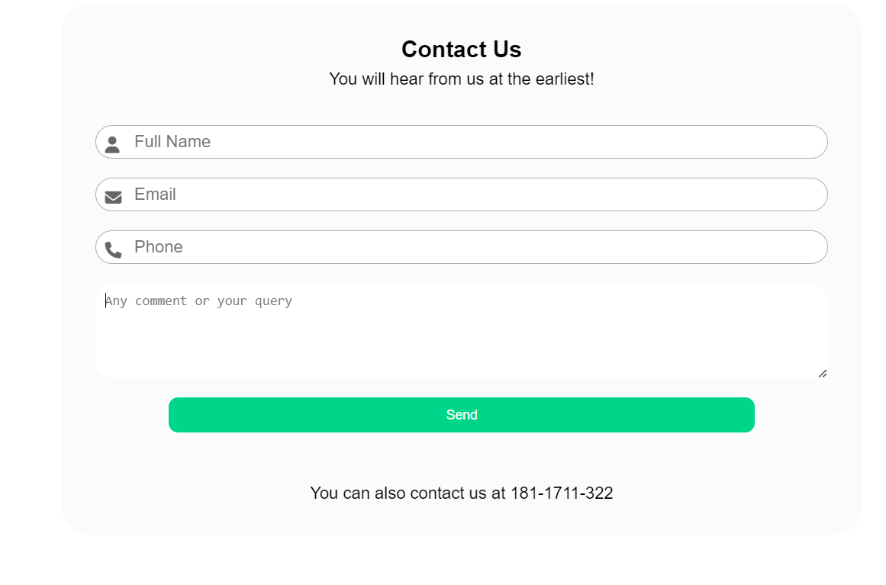

# contact page 

In the this page added some information obout the user and it can be added their **Full Name, Email Phone no** and **Suggestion**.
---
1. Full Name

     User can enter their name. Becouse the understand who person can enter the information. 
     

     html code
     ```html
         <div class="nameInp">
                    <i class="fa fa-user icon"></i>
                    <input type="text" placeholder="Full Name" name="name" id="name">
        </div>
     ```
---
2. Email

     User can enter their email. Becouse the understand who person can enter the information about the suggestion.

    html code
     ```html
         <div class="mailInp">
                    <i class="fa fa-envelope"></i>
                    <input type="email" name="mail" id="mail" placeholder="Email">
        </div>
     ```
     ---
3. Phone no
    
    User can enter their Phone no. Becouse the understand who person can enter the information about the suggestion.

    html code
     ```html
         <div class="phoneInp">
                    <i class="fa-solid fa-phone"></i>
                    <input type="number" name="phone" id="phone" placeholder="Phone" min="100000" max="9999999999">
         </div>
     ```
    ---
4. Suggestion
    
    User can enter their Suggestion. Becouse the understand who person can enter the information about the suggestion.

    html code
     ```html
         <div class="queryInp">
                    <textarea name="query" id="query" cols="30" rows="5"
                        placeholder="Any comment or your query"></textarea>
        </div>
     ```

---




if you contact us then you can contact us at this no which is given in above image.


